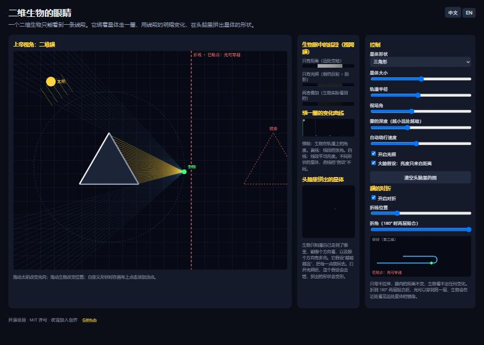

# Flatland Vision · 二维生物的眼睛

[English below](#english)

一个开源的交互式仿真：**如果我们是生活在二维膜上的生物，我们会怎样"看见"一颗星体？**

二维生物的视网膜是一条线。它看一个圆盘，只能看到一条线段；线段各处的明暗对应景深和光照。它绕着星体走一圈，把每一个方向看到的亮度放回去，在头脑里拼出星体的形状。三角形、正方形、月牙，走一圈的"指纹"各不相同。

在这个基础上，还能对这张膜做更多事：把它**对折**。只弯不拉伸时，膜内的距离不变，生物什么都察觉不到；折到两层贴合，光可以穿到另一层，生物会在近处看见远处星体的镜像。

在线试玩：**https://walterwood1995.github.io/flatland-vision/**



## 能做什么

- 选择星体形状：圆盘、三角形、正方形、五边形、五角星、非凸的月牙，或者点击画布自定义。
- 拖动太阳改变光向，看朗伯反射和阴影如何改变线段。
- 三条视网膜：只有距离、只有光照、两者叠加。
- 绕一圈的变化曲线：线段张角和平均亮度随轨道角度的变化，每种形状有自己的指纹。
- 头脑里拼出的星体：生物假设"越暗越远"做反推。打开光照后这个假设出错，拼出的形状会变形。这正是二维生物认识世界时的真实困境。
- 膜的对折：折线位置、折角可调，侧视图显示第三维里的形状。

## 本地运行

没有任何依赖，纯 HTML + JavaScript。

```bash
git clone https://github.com/WalterWood1995/flatland-vision.git
cd flatland-vision
python -m http.server 8000
# 打开 http://localhost:8000
```

直接双击 `index.html` 也可以。

## 背景

这个项目来自一组关于"膜宇宙"的探索：我们的空间可能是高维空间里的一张膜，物质压弯它就是引力，压过头就陷成口袋，那是黑洞。把这个图景降一维来看，就是一个二维生物在二维膜上的处境。相关的理论文字和仿真在作者的其他仓库和文章里，这个项目只做最直观的那一步：**让人亲眼看看二维生物看到的是什么**。

## 想一起做的事

下面是我们觉得有意思、但还没做的方向。欢迎认领，也欢迎提出新的。

- [ ] 膜上的"坑"：星体压弯膜，光线沿测地线走，看引力透镜在二维生物眼里是什么样。
- [ ] 口袋与窗：膜上陷出一个口袋，口袋底部与另一张膜相切，光从那里穿过去。
- [ ] 两张膜相交：交线在二维生物眼里是一条发光的缝。
- [ ] 升到三维：三维生物的视网膜是一个平面，看四维物体穿过三维空间。
- [ ] 生物的"大脑"换成真正的推断算法：从一圈的亮度序列反推形状（这是一个反问题）。
- [ ] 移动端触控支持。
- [ ] 更多语言。

## 贡献

见 [CONTRIBUTING.md](CONTRIBUTING.md)。提 issue、提 PR、或者只是来聊想法，都欢迎。

## 许可

MIT。随便用，注明出处就好。

---

## English

An open-source interactive simulation: **if we lived on a 2D membrane, how would we "see" a planet?**

A 2D creature's retina is a line. Looking at a disk, it sees only a line segment; the brightness along that segment encodes depth and lighting. Walking around the planet, it places each observed brightness back into space and reconstructs the shape in its mind. A triangle, a square, a crescent each leave a different "fingerprint" over one orbit.

On top of that, the membrane can be **folded**. Bending without stretching leaves intrinsic distances unchanged, so the creature notices nothing. Once the fold reaches 180° and the layers touch, light crosses over and the creature sees a mirror image of the far planet nearby.

Live demo: **https://walterwood1995.github.io/flatland-vision/**

### Features

- Planet shapes: disk, triangle, square, pentagon, star, non-convex crescent, or custom by clicking.
- Drag the sun; Lambert shading with shadows.
- Three retinas: depth only, lighting only, both.
- Signature plot over one orbit: angular width and mean brightness vs orbital angle.
- Mental reconstruction assuming "darker = farther"; see it warp when lighting is on.
- Membrane fold with adjustable position and angle, plus a side view of the third dimension.

### Run locally

No dependencies. Pure HTML + JavaScript.

```bash
git clone https://github.com/WalterWood1995/flatland-vision.git
cd flatland-vision
python -m http.server 8000
```

### Roadmap and contributing

See the checklist above and [CONTRIBUTING.md](CONTRIBUTING.md). Issues, pull requests and ideas are all welcome.

### License

MIT.
